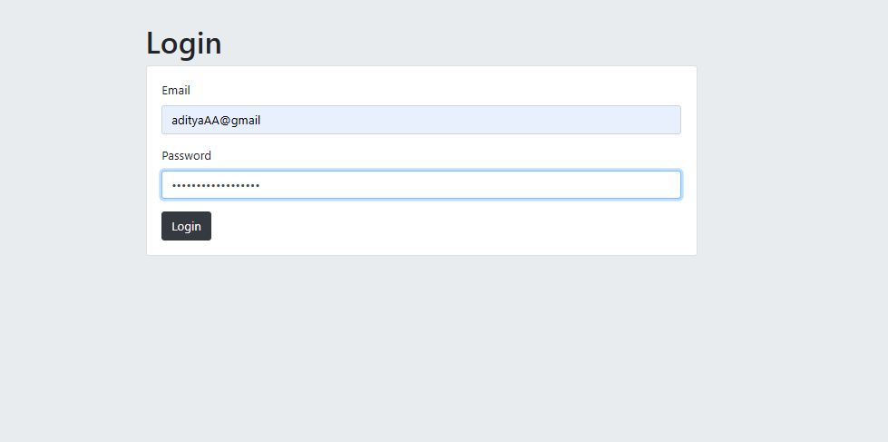

## 🔐 Login & Register Page – Level 4 Authentication (Sessions + Passport + Cookies):
---


This project is a Login & Register Authentication System built with Node.js, Express, EJS, PostgreSQL, Passport.js, express-session, and cookies.
It demonstrates Level 4 Authentication, where user passwords are securely salted & hashed (bcrypt.js), and authentication is managed with sessions and cookies using Passport.js.<br><br> ---
Users can:<br>
Register with an email and password.<br>
Log in securely (session stored in a cookie).<br>
Access a protected secrets page only when authenticated.<br>
Logout (session destroyed).<br>
The project follows a modular EJS structure using partials (header.ejs, footer.ejs) and serves static assets through the public/ folder.<br>


---
🔑 Levels of Authentication:<br><br>
Level 1: Basic Cipher (Caesar, Hill, Playfair, etc.)<br>
Level 2: Hashing (MD5, SHA, etc.)<br>
Level 3: Hashing + Salt Rounds (bcrypt)<br>
Level 4: Session-Based Authentication (bcrypt + Passport.js + Cookies)<br>
Level 5: Environment Variables + Session-Based Authentication<br>


---
📂 Project Structure:<br><br>
Authentication Lv.5<br>
├── .DS_Store<br>
├── .gitignore<br>
├── README.md<br>
├── css<br>
│ └── styles.css<br>
├── imgg<br>
│ ├── a3.png<br>
│ ├── al1.png<br>
│ ├── lgl1.png<br>
│ └── lv33.png<br>
├── index.js<br>
├── package-lock.json<br>
├── package.json<br>
├── partials<br>
│ ├── footer.ejs<br>
│ └── header.ejs<br>
├── public<br>
│ └── css<br>
│ └── styles.css<br>
├── queries.sql<br>
└── views<br>
├── home.ejs<br>
├── login.ejs<br>
├── partials<br>
│ ├── footer.ejs<br>
│ └── header.ejs<br>
├── register.ejs<br>
└── secrets.ejs<br>

---


## 📷 Gallery

| SignUp Page | Login Page |
|-------------|------------|
|  |  |

| Register Page | Secret Page |
|---------------|-------------|
|  |  |


---

## ⚙️ Setup Instructions

 1️⃣ Create Table in PostgreSQL(users):
 <br><br>
as given in the query.sql
 <br>
 
2️⃣ Install Dependencies:
```bash
npm i

```

3️⃣ Database Connection (index.js)
```bash
const app = express()
const db = new pg.Client({
  user: "postgres",
  host: "localhost",
  database: "XXXXX",    // <-- your database name
  password: "XXXXX",    // <-- your password
  port: XXXX,           // <-- your port name, by default for pg 5432
});
```
4️⃣ Run Server:
```bash
node index.js
```
---
👉 [Open App on Localhost](http://localhost:3000)
